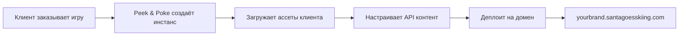

# Реверс-инжиниринг "Santa Goes Skiing"

## 1. Стек технологий и движок

### Движок: Кастомный фреймворк на Haxe → JavaScript

Основной код в `html5.js` (2+ MB) — это **обфусцированный и минифицированный код**, скомпилированный из **Haxe** (не Phaser, не Pixi.js напрямую). 

**Признаки:**
- Функция `a0_0x5a41()` — типичная обфускация JavaScript-обфускатором
- Структура кода и паттерны именования указывают на трансляцию Haxe → JS
- Использование WebGL для рендеринга (`WebGL`, `vertexAttribDivisor`, шейдеры)
- Bitmap-шрифты (`.fnt` + `.png`) — типичный подход для Haxe-фреймворков
- Паттерны `_uvs`, `disposeGeometry`, `vertexAttribDivisor` — OpenFL/Lime признаки

### Вспомогательные JS библиотеки

| Файл | Назначение |
|------|-----------|
| `tc_core.js` | Утилиты: cookie, fullscreen, clipboard, query params |
| `browserDetect.js` | Определение iOS/Android/desktop/tablet |
| `cookie.min.js` | GDPR cookie consent bar |
| `social.js` | Facebook/Twitter/LinkedIn/WhatsApp sharing |
| `dialog.js` | Модальные окна (alert/confirm/prompt) |
| `loader.min.js` | Canvas-анимация загрузки (spinning ring) |
| `colourConversion.min.js` | Конвертация цветов (hex/RGB/HSL/LAB/XYZ) |

---

## 2. Архитектура и структура проекта

### Структура ассетов

```
/assets/
├── xmas_bootstrap/
│   └── preloader/
│       ├── game_background.png              # Фон (landscape)
│       ├── game_background_portrait.png     # Фон (portrait)
│       ├── game_logo.png                    # Логотип игры
│       ├── GilroyExtraBold50N.fnt/.png     # Шрифт прелоадера
│       ├── preload_bar.png                  # Полоса загрузки
│       └── preload_bg.png                   # Фон полосы загрузки
│
├── xmas_ui/
│   ├── font/                                # Bitmap-шрифты
│   │   ├── GilroyBold20.fnt/.png
│   │   ├── GilroyExtraBold22N.fnt/.png
│   │   ├── GilroyExtraBold32N.fnt/.png
│   │   ├── GilroyExtraBold36.fnt/.png
│   │   ├── IntroRegular26/32/36.fnt/.png
│   │   ├── OpenSansBold20/22.fnt/.png
│   │   ├── OpenSansExtraBoldItalic24.fnt/.png
│   │   ├── OpenSansRegular22/28.fnt/.png
│   │   └── OpenSansSemiBold24/28/32.fnt/.png
│   │
│   └── ui/                                  # UI элементы
│       ├── btn_connect_over/up.png         # Кнопки коннекта
│       ├── btn_extra_large_over/up.png     # Большие кнопки
│       ├── btn_large_over/up.png           # Обычные кнопки
│       ├── btn_music_on/off_large.png      # Музыка on/off
│       ├── btn_sound_on/off_large.png      # Звуки on/off
│       ├── btn_privacy_large.png           # Приватность
│       ├── btn_settings.png                # Настройки
│       ├── btn_share_*.png                 # Шаринг (FB, Twitter, etc)
│       ├── icon_gates.png                  # Иконка ворот
│       ├── start_instruction_flag_icons.png # Иконки флагов для туториала
│       └── ... (клавиатура виртуальная)
│
├── xmas_ski/
│   └── game/                                # Игровые спрайты
│       ├── flag_blue.png / flag_blue_hit.png
│       ├── flag_red.png / flag_red_hit.png
│       ├── gate_dir.png                     # Стрелка направления ворот
│       ├── small_tree_01/02.png
│       ├── medium_tree_01/02.png
│       ├── large_tree_01/02.png
│       ├── xmas_tree_01/02.png
│       ├── boulder_01/02.png
│       ├── banner_*.png
│       ├── top_trees.png                    # Деревья на верхней границе
│       └── ... (другие декорации)
│
└── xmas_audio/
    ├── music/
    │   ├── music_gameplay.ogg              # Музыка геймплея
    │   └── music_menu.ogg                  # Музыка меню
    │
    └── sfx/
        ├── button_player.ogg
        ├── button_select.ogg
        ├── button_tab.ogg
        ├── click.ogg
        ├── pickup_gate.ogg
        └── ... (другие эффекты)
```

### API Endpoints

#### `GET /api/game/content`

Возвращает JSON с конфигурацией игры:

```json
{
  "content": {
    "menuIntro": "Play this demo to win one of 10 mystery prizes drawn each month!",
    "menuCTA": "Score more than {*targetscore*} points for your chance to win.",
    "menuPlayBtn": "PLAY NOW",
    "menuLeaderboardBtn": "LEADERBOARD",
    "brandURL": "https://peekandpoke.com/...",
    "menuPrizeURL": "https://peekandpoke.com/...",
    "gameDemoInstruction": "TAP THE SCREEN TO PLAY!",
    "gameScoreTitle": "SCORE",
    "gameTutorialKeys": "Tap the left and right keys to turn.",
    "gameTutorialTouch": "Tap the left and right sides of the screen to turn.",
    "gameTutorialGates": "Ski between flag pairs.",
    "gameTutorialCombo": "Persue the pairs to multiply points.",
    "gameTutorialObstacles": "...",
    ...
  }
}
```

### Конфигурация уровней

**Level 1 (Tutorial):**
```json
{
  "loopPoint": 0,
  "obstacleSets": {
    "Hey": ["These are pulled from level 2"]
  },
  "sections": [
    {
      "distance": 500,
      "decals": { "enabled": true, "start": 200, "end": 200 },
      "gates": { "enabled": false },
      "obstacles": { "enabled": false },
      "snowman": { "enabled": false },
      "trails": { "enabled": false },
      "coins": { "enabled": false },
      "playerSpeed": { "start": 1, "end": 4 }
    },
    {
      "distance": 300,
      "gates": { "enabled": true, "distance": {...} },
      ...
    }
  ]
}
```

**Level 2 (Main Game):**
```json
{
  "loopPoint": 10,
  "obstacleSets": {
    "Forest": [
      "SmallTree1", "SmallTree2",
      "MediumTree1", "MediumTree2",
      "LargeTree1", "LargeTree2"
    ],
    "Beginner": [
      "SmallTree1", "SmallTree2",
      "MediumTree1", "MediumTree2",
      "LargeTree1", "LargeTree2",
      "XmasTree1", "Boulder1", "Boulder2"
    ],
    "Intermediate": [
      ... (больше деревьев в весах),
      "Banner"
    ],
    "Advanced": [
      ... (ещё больше препятствий)
    ]
  },
  "sections": [...]
}
```

---

## 3. Игровая механика

### Управление

**Touch (мобильные):**
- Касание левой половины экрана → поворот влево
- Касание правой половины экрана → поворот вправо

**Keyboard (десктоп):**
- Стрелка влево / A → поворот влево
- Стрелка вправо / D → поворот вправо

**Физика инерции:**
- Игрок всегда движется **вниз** с постоянной скоростью
- При повороте изменяется только **горизонтальная составляющая**
- Из-за инерции при смене направления (влево → вправо) получается **дуга**
- Похоже на управление в Doodle Jump или Ski Safari

### Игровой цикл

**Старт:**
1. Загрузка ассетов (прелоадер с прогресс-баром)
2. Главное меню: PLAY NOW / LEADERBOARD / настройки
3. Нажатие PLAY → туториал (первая секция 500 единиц без препятствий)

**Прогрессия:**
- Скорость игрока: начальная `1.0`, постепенно до `4.0+`
- Уровень разбит на **секции** (sections) по расстоянию
- Каждая секция настраивает:
  - Включение/выключение ворот (gates)
  - Включение/выключение препятствий (obstacles)
  - Набор препятствий (obstacleSet: "Beginner" / "Intermediate" / "Advanced")
  - Диапазон скорости (playerSpeed.start / end)

**Ворота (Gates):**
- Пары флагов: синий слева, красный справа (или наоборот)
- Проход между флагами = очки
- **Комбо-система**: прохождение ворот подряд → мультипликатор (`GATE_MULTIPLIER`)
- Пропуск ворот = сброс комбо

**Препятствия:**
- Столкновение с препятствием → Game Over
- Типы препятствий:
  - `SmallTree1`, `SmallTree2` — маленькие деревья
  - `MediumTree1`, `MediumTree2` — средние деревья
  - `LargeTree1`, `LargeTree2` — большие деревья
  - `XmasTree1`, `XmasTree2` — новогодние ёлки
  - `Boulder1`, `Boulder2` — валуны
  - `Banner` — баннеры (на продвинутых уровнях)

**Подарки/Монеты:**
- Разбросаны по трассе (coins в конфиге)
- Сбор = очки (разные размеры = разные значения)

**Game Over:**
1. Экран результатов: финальный счёт, пройденная дистанция
2. Лидерборд (сравнение с другими игроками)
3. Кнопки: PLAY AGAIN / LEADERBOARD / SHARE

---

## 4. Аналитика, Cookie, Идентификаторы

### Google Analytics 4

**ID:** `G-GRTXHNVQRP`

**События:**
- `user_engagement` — базовое взаимодействие
- Параметры: `instance_name=yourbrand`, `skin=xmas`

**Client ID (cid):**
- Формат: `{timestamp}.{random}`
- Пример: `1690614142.1767695953`
- Хранится в cookie, генерируется при первом визите

### Cookie System

**GDPR Consent:**
- Cookie: `__ppcp` (Peek & Poke Cookie Preferences)
- Срок хранения: **90 дней**
- Структура: `{e: bool, s: bool, t: bool, a: bool}`
  - `e` — **Essential** (обязательные)
  - `s` — **Statistics** (статистика)
  - `t` — **ThirdPartyStatistics** (сторонняя статистика, напр. Google Analytics)
  - `a` — **Additional** (дополнительные)

**Cookie Panel:**
- Реализован через `CookieBar` класс в `cookie.min.js`
- Функции:
  - `tc_setCookie(name, value)` — установка cookie
  - `tc_getCookie(name)` — получение cookie
  - `tc_showCookiePanel()` — показать панель настроек

### Идентификация игрока

**Нет явной авторизации:**
- Игра полностью анонимная
- Лидерборд скорее всего привязан к:
  - Session ID (в cookie)
  - Client ID из GA
  - Или временный идентификатор в localStorage

**Facebook Login (опционально):**
- Через `social.js` → `tc_startFacebookLogin()`
- API: `/me/permissions`, `/me/friends`
- Но в демо-версии отключен

---

## 5. Кастомизация и White-Label архитектура

### Peek & Poke White-Label Platform

Игра создана как **готовое решение** для брендирования:

**Уровни кастомизации:**

#### 1. **Скины/Темы**
```
/assets/xmas_*/      # Текущая тема: Xmas
/assets/spring_*/    # Можно создать: Spring
/assets/summer_*/    # Можно создать: Summer
```

#### 2. **Контент через API**
Все тексты UI конфигурируются через `/api/game/content`:
- Заголовки меню
- Инструкции
- Кнопки
- URL бренда
- URL призов/правил

#### 3. **Визуальный брендинг**
- `game_logo.png` — логотип игры
- `game_background.png` — фон меню
- Цветовая схема через CSS variables
- `manifest.json` — PWA иконки и названия

#### 4. **Геймплей**
JSON-конфигурация уровней:
- Длина секций
- Скорость прогрессии
- Наборы препятствий
- Частота появления ворот
- Система сложности

#### 5. **Интеграция**
- Cookie consent настраивается (GDPR compliance)
- Google Analytics ID заменяется
- Facebook App ID для шаринга
- Социальные сети: FB / Twitter / LinkedIn / WhatsApp

### Процесс кастомизации (предполагаемый)



**Пример доменов:**
- `yourbrand.santagoesskiing.com` (демо)
- `client1.santagoesskiing.com`
- `christmas.brandname.com`

---

## 6. Пригодность для Telegram Mini App

### ✅ Плюсы

1. **Полностью клиентская игра**
   - Статика (HTML/CSS/JS) + API для контента
   - Не требует постоянного соединения после загрузки
   - Можно кэшировать агрессивно

2. **Touch-управление уже реализовано**
   - Работает на мобильных
   - Простая схема управления (2 зоны)

3. **PWA-ready**
   - `manifest.json` — уже есть
   - Иконки в разных размерах
   - `fullscreen` display mode

4. **Легковесный прелоадер**
   - Canvas-анимация
   - Минимальный JS для загрузчика

5. **Модульная архитектура**
   - Cookie consent можно отключить в TG
   - Социальный шаринг заменить на TG Share API

### ❌ Минусы

1. **Большой размер JS (2+ MB)**
   - `html5.js` — 2+ MB обфусцированного кода
   - Долгая первая загрузка в Telegram
   - **Решение:** code splitting, lazy loading ассетов

2. **Haxe-движок = закрытый код**
   - Сложно модифицировать без исходников
   - Нельзя доработать логику напрямую
   - **Решение:** писать свою игру на Phaser/PixiJS

3. **Нет интеграции с TG**
   - Лидерборд через свой backend
   - Авторизация через Telegram SDK нужно добавлять
   - **Решение:** бэкенд на Node.js + Telegram Bot API

4. **Google Analytics**
   - В TG Mini Apps лучше использовать свою аналитику
   - **Решение:** заменить на Telegram Analytics или Amplitude

### Рекомендации для адаптации под TG

```javascript
// 1. Убрать cookie consent
// tc_showCookiePanel() → не вызывать

// 2. Заменить шаринг
// tc_shareOnFacebook() → Telegram.WebApp.shareToStory()

// 3. Добавить TG авторизацию
const initData = Telegram.WebApp.initData;
const user = Telegram.WebApp.initDataUnsafe.user;

// 4. Лидерборд через Telegram Cloud Storage
Telegram.WebApp.CloudStorage.setItem('high_score', score);

// 5. Вибрация при столкновении
Telegram.WebApp.HapticFeedback.impactOccurred('heavy');
```

---

## 7. Рекомендации для Snow Rush 2026

### Стек технологий

**Движок:** Phaser 3 или PixiJS  
**Язык:** TypeScript  
**Сборка:** Vite  
**Backend:** Node.js + Express  
**Database:** PostgreSQL или MongoDB  
**Telegram:** [@twa-dev/sdk](https://www.npmjs.com/package/@twa-dev/sdk)

### Структура проекта

```
snow-rush-2026/
├── src/
│   ├── scenes/
│   │   ├── BootScene.ts          # Прелоадер
│   │   ├── MenuScene.ts          # Главное меню
│   │   ├── GameScene.ts          # Игровой процесс
│   │   └── GameOverScene.ts      # Результаты
│   │
│   ├── entities/
│   │   ├── Player.ts             # Игрок на лыжах
│   │   ├── Gift.ts               # Подарки
│   │   ├── Obstacle.ts           # Препятствия
│   │   └── Booster.ts            # Бустеры (магнит, шлем)
│   │
│   ├── systems/
│   │   ├── InputManager.ts       # Управление
│   │   ├── CollisionManager.ts   # Коллизии
│   │   ├── SpawnManager.ts       # Генерация объектов
│   │   ├── ScoreManager.ts       # Подсчёт очков
│   │   └── BoosterManager.ts     # Управление бустерами
│   │
│   ├── config/
│   │   ├── gameConfig.ts         # Настройки игры
│   │   └── levels.json           # Конфиг уровней
│   │
│   └── main.ts
│
├── assets/
│   ├── sprites/
│   ├── audio/
│   └── fonts/
│
├── server/
│   ├── index.ts                  # Express сервер
│   ├── routes/
│   │   ├── leaderboard.ts
│   │   └── auth.ts
│   └── db/
│
└── package.json
```

### Ключевые механики

#### 1. Инерция движения

```typescript
class Player extends Phaser.GameObjects.Sprite {
  private velocity = new Phaser.Math.Vector2(0, 0);
  private baseSpeed = 300; // пикселей в секунду
  private turnSpeed = 150;
  private targetX = 0;

  update(delta: number) {
    // Постоянное движение вниз
    this.y += this.baseSpeed * (delta / 1000);

    // Плавный поворот с инерцией
    const smoothing = 0.1; // чем меньше, тем плавнее
    this.velocity.x = Phaser.Math.Linear(
      this.velocity.x,
      this.targetX * this.turnSpeed,
      smoothing
    );

    this.x += this.velocity.x * (delta / 1000);

    // Ограничение по границам экрана
    this.x = Phaser.Math.Clamp(this.x, 50, this.scene.scale.width - 50);

    // Наклон спрайта в сторону поворота
    this.rotation = this.velocity.x / this.turnSpeed * 0.2;
  }

  turnLeft() {
    this.targetX = -1;
  }

  turnRight() {
    this.targetX = 1;
  }

  stopTurn() {
    this.targetX = 0;
  }
}
```

#### 2. Система секций уровня

```typescript
// levels.json
{
  "sections": [
    {
      "distance": 500,
      "obstacles": false,
      "gifts": { "enabled": true, "density": 0.3 },
      "speed": { "start": 300, "end": 400 }
    },
    {
      "distance": 800,
      "obstacles": true,
      "obstacleSet": "easy",
      "gifts": { "enabled": true, "density": 0.5 },
      "speed": { "start": 400, "end": 500 }
    },
    {
      "distance": 1000,
      "obstacles": true,
      "obstacleSet": "medium",
      "boosters": { "enabled": true, "types": ["magnet", "helmet"] },
      "speed": { "start": 500, "end": 650 }
    }
  ],
  "obstacleSets": {
    "easy": [
      { "type": "tree_small", "weight": 3 },
      { "type": "rock", "weight": 1 }
    ],
    "medium": [
      { "type": "tree_small", "weight": 2 },
      { "type": "tree_large", "weight": 2 },
      { "type": "rock", "weight": 1 },
      { "type": "fence", "weight": 1 }
    ]
  }
}
```

```typescript
class SpawnManager {
  private currentSection = 0;
  private distanceTraveled = 0;
  private config = levelsConfig;

  update(deltaDistance: number) {
    this.distanceTraveled += deltaDistance;

    const section = this.getCurrentSection();
    
    // Интерполяция скорости
    const progress = this.getSectionProgress();
    const speed = Phaser.Math.Linear(
      section.speed.start,
      section.speed.end,
      progress
    );
    
    // Спавн объектов
    if (section.obstacles) {
      this.spawnObstacles(section.obstacleSet);
    }
    
    if (section.gifts.enabled) {
      this.spawnGifts(section.gifts.density);
    }
  }
}
```

#### 3. Бустеры

```typescript
enum BoosterType {
  MAGNET,   // Притягивает подарки
  HELMET,   // Защита на 3 удара
  SPEED     // Ускорение
}

class BoosterManager {
  private activeBoosters = new Map<BoosterType, BoosterState>();

  activate(type: BoosterType) {
    switch (type) {
      case BoosterType.MAGNET:
        this.activeBoosters.set(type, {
          duration: 5000, // 5 секунд
          startTime: Date.now()
        });
        this.expandGiftColliders();
        break;

      case BoosterType.HELMET:
        this.activeBoosters.set(type, {
          hits: 3,
          unlimited: false
        });
        this.player.setInvincible(true);
        break;

      case BoosterType.SPEED:
        this.activeBoosters.set(type, {
          duration: 3000,
          multiplier: 1.5
        });
        break;
    }
  }

  onCollision(obstacle: Obstacle) {
    const helmet = this.activeBoosters.get(BoosterType.HELMET);
    if (helmet) {
      helmet.hits--;
      if (helmet.hits <= 0) {
        this.deactivate(BoosterType.HELMET);
      }
      return false; // не Game Over
    }
    return true; // Game Over
  }

  private expandGiftColliders() {
    const magnetRadius = 200;
    this.scene.gifts.forEach(gift => {
      const dist = Phaser.Math.Distance.Between(
        this.player.x, this.player.y,
        gift.x, gift.y
      );
      
      if (dist < magnetRadius) {
        // Притягиваем подарок к игроку
        this.scene.tweens.add({
          targets: gift,
          x: this.player.x,
          y: this.player.y,
          duration: 300,
          ease: 'Quad.easeIn'
        });
      }
    });
  }
}
```

#### 4. Объектный пул для производительности

```typescript
class ObjectPool<T extends Phaser.GameObjects.GameObject> {
  private available: T[] = [];
  private inUse = new Set<T>();
  
  constructor(
    private scene: Phaser.Scene,
    private factory: () => T,
    private initialSize = 20
  ) {
    for (let i = 0; i < initialSize; i++) {
      const obj = factory();
      obj.setActive(false).setVisible(false);
      this.available.push(obj);
    }
  }

  acquire(): T {
    let obj = this.available.pop();
    if (!obj) {
      obj = this.factory();
    }
    obj.setActive(true).setVisible(true);
    this.inUse.add(obj);
    return obj;
  }

  release(obj: T) {
    obj.setActive(false).setVisible(false);
    this.inUse.delete(obj);
    this.available.push(obj);
  }

  clear() {
    this.inUse.forEach(obj => this.release(obj));
  }
}

// Использование
class GameScene extends Phaser.Scene {
  private giftPool: ObjectPool<Gift>;
  private obstaclePool: ObjectPool<Obstacle>;

  create() {
    this.giftPool = new ObjectPool(
      this,
      () => new Gift(this, 0, 0),
      50
    );

    this.obstaclePool = new ObjectPool(
      this,
      () => new Obstacle(this, 0, 0, 'tree'),
      30
    );
  }

  spawnGift(x: number, y: number) {
    const gift = this.giftPool.acquire();
    gift.setPosition(x, y);
    gift.reset();
    return gift;
  }

  removeGift(gift: Gift) {
    this.giftPool.release(gift);
  }
}
```

### Интеграция с Telegram Mini App

```typescript
import WebApp from '@twa-dev/sdk';

// Инициализация
WebApp.ready();
WebApp.expand(); // Полноэкранный режим

// Получение данных пользователя
const user = WebApp.initDataUnsafe.user;
console.log(`Player: ${user.first_name} (ID: ${user.id})`);

// Авторизация на бэкенде
async function authenticateUser() {
  const response = await fetch('/api/auth/telegram', {
    method: 'POST',
    headers: { 'Content-Type': 'application/json' },
    body: JSON.stringify({
      initData: WebApp.initData
    })
  });
  const { token } = await response.json();
  return token;
}

// Отправка счёта в лидерборд
async function submitScore(score: number, token: string) {
  await fetch('/api/leaderboard/submit', {
    method: 'POST',
    headers: {
      'Content-Type': 'application/json',
      'Authorization': `Bearer ${token}`
    },
    body: JSON.stringify({ score })
  });
}

// Вибрация при событиях
WebApp.HapticFeedback.impactOccurred('light');  // Сбор подарка
WebApp.HapticFeedback.impactOccurred('heavy');  // Столкновение

// Шаринг результата
function shareScore(score: number) {
  const url = `https://t.me/share/url?url=${encodeURIComponent(
    `Я набрал ${score} очков в Snow Rush 2026! Попробуй обогнать меня!`
  )}`;
  WebApp.openTelegramLink(url);
}

// Главная кнопка
WebApp.MainButton.setText('ИГРАТЬ СНОВА');
WebApp.MainButton.onClick(() => {
  restartGame();
});
WebApp.MainButton.show();
```

### Backend для лидерборда

```typescript
// server/routes/leaderboard.ts
import express from 'express';
import { authenticateTelegram } from '../middleware/auth';
import { db } from '../db';

const router = express.Router();

// Отправка счёта
router.post('/submit', authenticateTelegram, async (req, res) => {
  const { score } = req.body;
  const userId = req.user.id;

  await db.query(
    `INSERT INTO leaderboard (user_id, username, score, created_at)
     VALUES ($1, $2, $3, NOW())
     ON CONFLICT (user_id) DO UPDATE
     SET score = GREATEST(leaderboard.score, $3),
         username = $2`,
    [userId, req.user.username, score]
  );

  res.json({ success: true });
});

// Получение топ-100
router.get('/top', async (req, res) => {
  const result = await db.query(
    `SELECT user_id, username, score, created_at,
            RANK() OVER (ORDER BY score DESC) as rank
     FROM leaderboard
     ORDER BY score DESC
     LIMIT 100`
  );

  res.json(result.rows);
});

// Получение позиции игрока
router.get('/me', authenticateTelegram, async (req, res) => {
  const userId = req.user.id;

  const result = await db.query(
    `SELECT user_id, username, score, created_at,
            RANK() OVER (ORDER BY score DESC) as rank
     FROM leaderboard
     WHERE user_id = $1`,
    [userId]
  );

  res.json(result.rows[0] || null);
});

export default router;
```

---

## 8. Выводы

### Что можно взять из Santa Goes Skiing

✅ **Архитектура:**
- Система секций для прогрессии сложности
- JSON-конфигурация уровней
- Разделение на Bootstrap → UI → Game ассеты

✅ **Механики:**
- Инерционное управление
- Объектные пулы для оптимизации
- Bitmap-шрифты для производительности

✅ **UX:**
- Простой туториал в первой секции
- Чёткие визуальные подсказки (стрелки, иконки)
- Прогресс-бар загрузки

### Что улучшить в Snow Rush 2026

🔧 **Технически:**
- Использовать современный движок (Phaser 3)
- TypeScript для типобезопасности
- Меньший размер бандла (< 500 KB)

🔧 **Геймплей:**
- Более явная система бустеров (визуальные таймеры)
- Дневные челленджи для retention
- Система достижений

🔧 **Telegram-специфично:**
- Интеграция с друзьями через TG API
- In-app покупки через Telegram Payments
- Реферальная система

---

## Приложение: Ссылки

- **Демо игры:** https://yourbrand.santagoesskiing.com/
- **Разработчик:** [Peek & Poke](https://peekandpoke.com/)
- **Phaser 3 Docs:** https://photonstorm.github.io/phaser3-docs/
- **Telegram Mini Apps:** https://core.telegram.org/bots/webapps
- **TWA SDK:** https://www.npmjs.com/package/@twa-dev/sdk

---

**Дата анализа:** 6 января 2026  
**Версия документа:** 1.0
